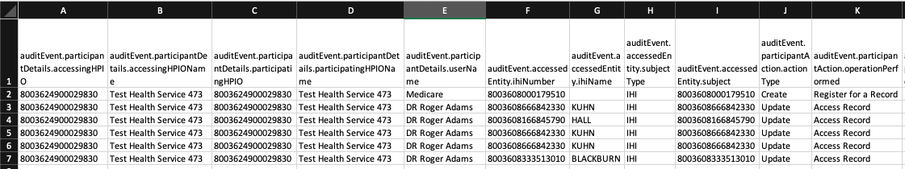
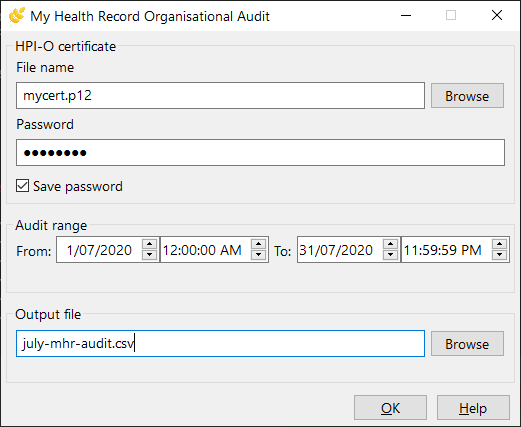
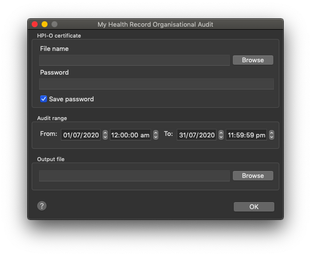

# My Health Record Organisational Audit Tool (MHROAT)

Monitor your organisation's use of the My Health Record.

## Purpose

Many clinical information systems allow you to interact with the [My Health Record](https://www.myhealthrecord.gov.au/), but very few provide an acceptable audit trail for ensuring compliance with legislation and policy. Some systems expose the audit view incompletely, others allow modification of their internal logs, and still others provide no insight—requiring you to make time-consuming requests to the My Health Record system operator.



MHROAT is designed to be used by Responsible Officers (ROs) and their delegates, such as IT administrators, to access the audit records stored within the My Health Record system, including data such as who accessed a record, what documents they read and what changes were made.

This tool is not for patients (who should use the My Health Record website's Record Access History function) or individual healthcare providers (who should ask their My Health Record administrator or Responsible Officer for this information).

## Download

MHROAT is free to download and use from the [GitHub releases page](https://github.com/zanchey/porridge/releases). This software is licensed under the [GNU GPL version 3.0 or later](license.txt), which means that you can use it for any purpose and redistribute it freely.

The source code for MHROAT is freely available under this license. It can be downloaded from the [GitHub project page](https://github.com/zanchey/porridge/). It includes resources from the Australian National E-Health Transition Agency, licensed under the [Apache 2.0 license](resources/pcehr_schema/license.txt). See the [CONTRIBUTING](CONTRIBUTING.md) file for more information on using the source code.

## Usage

### Graphical interface

To start the graphical interface, download and run the "MHROAT" file for your platform (Windows or macOS).

 

You will need to supply a HPI-O certificate file and its password, the dates and times to include audit records, and an output CSV file.

The password for the certificate is saved in the operating system's secure storage by default. Uncheck the "Save password" option to disable this.

### Command-line interface

MHROAT can be used from the command-line, and supports use in scripts.

On Windows, download and run the `mhroatc.exe` file. On macOS, run `MHROAT.app/Contents/MacOS/MHROAT`.

The command-line usage is summarised below.

```
usage: mhroat [-h] -c CERT_FILE [-P] [-S] [-f DATE_FROM]
              [--time-from TIME_FROM] [-t DATE_TO] [--time-to TIME_TO] -o
              OUTPUT_FILE

optional arguments:
  -h, --help            show this help message and exit
  -c CERT_FILE, --cert-file CERT_FILE
                        Certificate file (required)
  -P, --prompt-password
                        Always prompt for password
  -S, --no-store-password
                        Never store password
  -f DATE_FROM, --date-from DATE_FROM
                        Audit start date (YYYY-MM-DD) - defaults to first day
                        of this month
  --time-from TIME_FROM
                        Audit start time (HH:MM, 24-hour format) - defaults to
                        midnight
  -t DATE_TO, --date-to DATE_TO
                        Audit end date (YYYY-MM-DD) - defaults to today
  --time-to TIME_TO     Audit end time (HH:MM, 24-hour format) - defaults to
                        midnight
  -o OUTPUT_FILE, --output-file OUTPUT_FILE
                        Output CSV file (required)

```

## Getting help

MHROAT is a free, open-source tool. Questions, bug reports and suggestions can be submitted at the [GitHub issues page](https://github.com/zanchey/porridge/issues) and will be handled on a best-effort basis. For commercial arrangements, you can contact mail@davidadam.com.au.

## Authors

MHROAT was written in 2018-2020 by David Adam (<mail@davidadam.com.au>).

Thanks go to the many contributors to GPs Down Under who had concerns about the auditing capability built into their clinical information systems, and to the Australian Digital Health Agency for their published resources and engagement with the development process.
